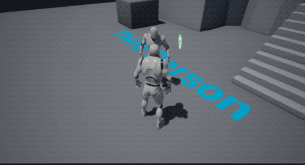
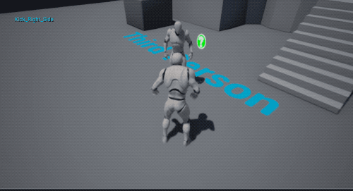
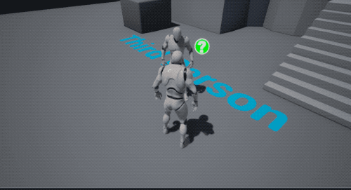
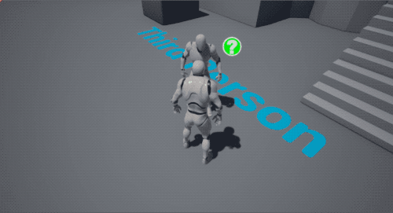
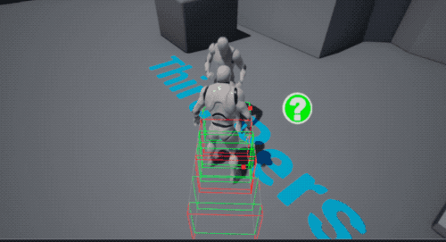
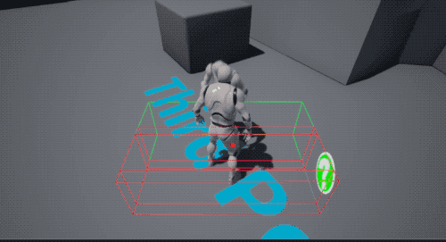
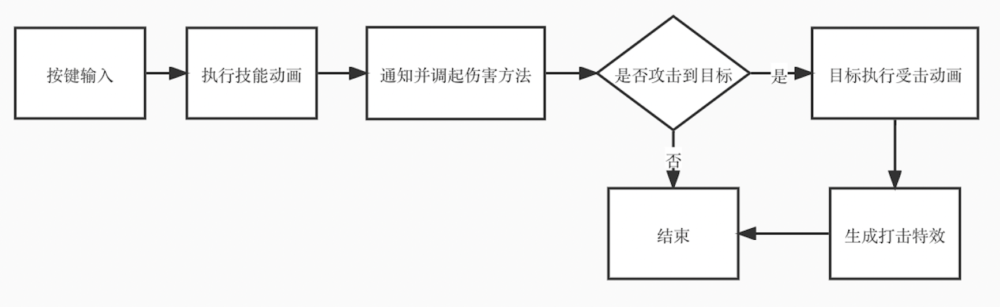
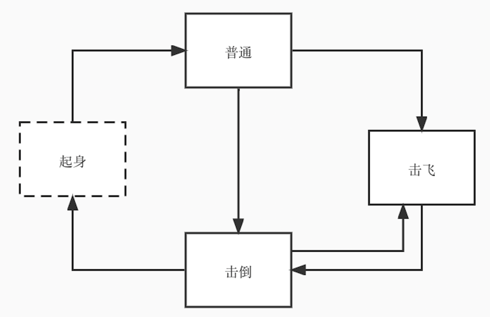
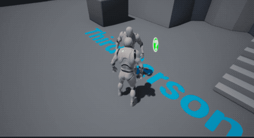
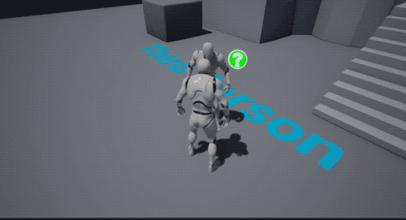

# ACTDemo
基于UE4实现的ACT技能Demo

项目将C++实现的功能逻辑插件化(见Plugin下ACTGame模块)，主项目以蓝图为主。

### 示例

### 技能设计

#### 连击
实现技能连击的效果实际是不断的改变或重复角色的受击效果。
Demo中，角色的受击状态可以分3种，普通、击飞、击倒。

上图中**起身状态属于过渡态**。实际从击倒到准备开始起身的时候，角色的状态已转回普通状态，使得在起身过程中角色仍然可以被击倒或击飞。

